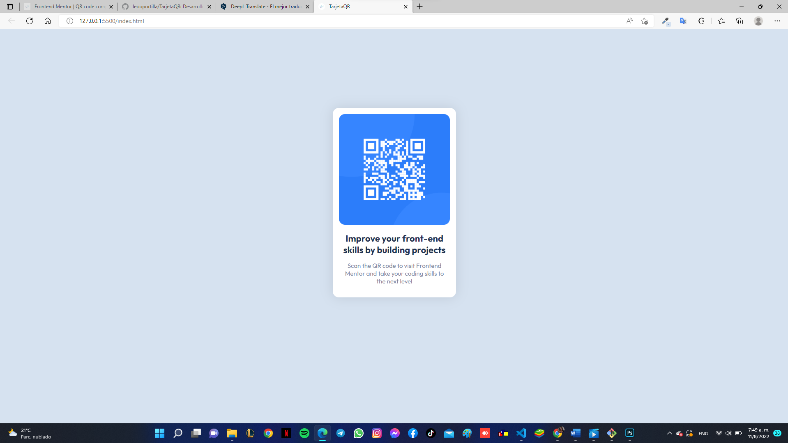

# Frontend Mentor - QR code component solution
## Overview
Desafio sencillo pero asi poder aprender o reforzar las area del CSS y HTML primordiales

### Screenshot

### Built with
- Semantic HTML5 markup
- CSS custom properties

### What I learned
Logre manejar con facilidad parte del HTML, con codigos sencillos para maquetar asi la tarjeta y para darle diseño el CSS con las propiedades mas utiles me ayudaron mucho, el box-shadow es muy bueno para las sobras funciona simple:
Box-shadow: X Y Opacidad Tamaño y Color
Las variables tambien pueden ayudar mucho en un futuro cambiando los colores o un aspecto repetitivo, asi solo cambiando ese valor cambiarias todo.

### Continued development
Quiero dedicarme mas a lo interativo de la pagina.
your own plans for continued development.**

### Useful resources
Gracias a AlexCG Design con su curso de CSS me ayudo bastante en el aprendizaje, tiene un contenido muy completo. https://www.youtube.com/watch?v=WfDqFArJnYA&t=2725s&ab_channel=AlexCGDesign

## Author

- Website - [Jose Leonardo Portilla]
- Frontend Mentor - [@leooportilla]

